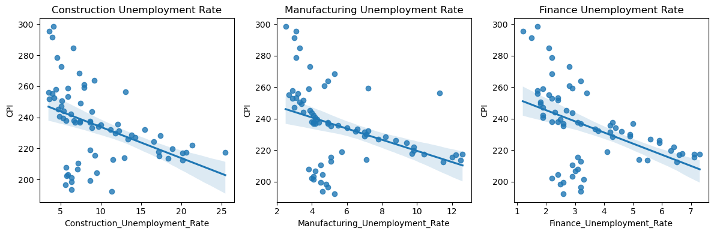

```python
import pandas as pd
import numpy as np
import seaborn as sns
import statsmodels.api as sm
from sklearn.linear_model import LinearRegression
from statsmodels.formula.api import ols as sm_ols
from statsmodels.iolib.summary2 import summary_col # nicer tables
import matplotlib.pyplot as plt
```


```python
merged = pd.read_csv("./inputs/merged.csv")
```


```python
merged
```


<div>
<style scoped>
    .dataframe tbody tr th:only-of-type {
        vertical-align: middle;
    }

    .dataframe tbody tr th {
        vertical-align: top;
    }

    .dataframe thead th {
        text-align: right;
    }
</style>
<table border="1" class="dataframe">
  <thead>
    <tr style="text-align: right;">
      <th></th>
      <th>Year</th>
      <th>Period</th>
      <th>Label</th>
      <th>SP500_Return</th>
      <th>Percent_Change_in_GDP</th>
      <th>CPI</th>
      <th>Construction_Unemployment_Rate</th>
      <th>Manufacturing_Unemployment_Rate</th>
      <th>Finance_Unemployment_Rate</th>
    </tr>
  </thead>
  <tbody>
    <tr>
      <th>0</th>
      <td>2005</td>
      <td>Q01</td>
      <td>2005 Qtr1</td>
      <td>-0.0259</td>
      <td>4.5</td>
      <td>192.366667</td>
      <td>11.4</td>
      <td>5.3</td>
      <td>2.6</td>
    </tr>
    <tr>
      <th>1</th>
      <td>2005</td>
      <td>Q02</td>
      <td>2005 Qtr2</td>
      <td>0.0091</td>
      <td>2.0</td>
      <td>193.666667</td>
      <td>6.4</td>
      <td>4.6</td>
      <td>3.2</td>
    </tr>
    <tr>
      <th>2</th>
      <td>2005</td>
      <td>Q03</td>
      <td>2005 Qtr3</td>
      <td>0.0315</td>
      <td>3.2</td>
      <td>196.600000</td>
      <td>5.6</td>
      <td>4.9</td>
      <td>3.2</td>
    </tr>
    <tr>
      <th>3</th>
      <td>2005</td>
      <td>Q04</td>
      <td>2005 Qtr4</td>
      <td>0.0159</td>
      <td>2.3</td>
      <td>198.433333</td>
      <td>6.4</td>
      <td>4.8</td>
      <td>2.5</td>
    </tr>
    <tr>
      <th>4</th>
      <td>2006</td>
      <td>Q01</td>
      <td>2006 Qtr1</td>
      <td>0.0373</td>
      <td>5.5</td>
      <td>199.466667</td>
      <td>8.7</td>
      <td>4.5</td>
      <td>2.6</td>
    </tr>
    <tr>
      <th>...</th>
      <td>...</td>
      <td>...</td>
      <td>...</td>
      <td>...</td>
      <td>...</td>
      <td>...</td>
      <td>...</td>
      <td>...</td>
      <td>...</td>
    </tr>
    <tr>
      <th>67</th>
      <td>2021</td>
      <td>Q04</td>
      <td>2021 Qtr4</td>
      <td>0.1040</td>
      <td>7.0</td>
      <td>278.706667</td>
      <td>4.6</td>
      <td>3.1</td>
      <td>2.2</td>
    </tr>
    <tr>
      <th>68</th>
      <td>2022</td>
      <td>Q01</td>
      <td>2022 Qtr1</td>
      <td>-0.0518</td>
      <td>-1.6</td>
      <td>284.893667</td>
      <td>6.6</td>
      <td>3.3</td>
      <td>2.1</td>
    </tr>
    <tr>
      <th>69</th>
      <td>2022</td>
      <td>Q02</td>
      <td>2022 Qtr2</td>
      <td>-0.1663</td>
      <td>-0.6</td>
      <td>291.535667</td>
      <td>4.0</td>
      <td>3.0</td>
      <td>1.5</td>
    </tr>
    <tr>
      <th>70</th>
      <td>2022</td>
      <td>Q03</td>
      <td>2022 Qtr3</td>
      <td>-0.0517</td>
      <td>3.2</td>
      <td>295.495667</td>
      <td>3.6</td>
      <td>3.1</td>
      <td>1.2</td>
    </tr>
    <tr>
      <th>71</th>
      <td>2022</td>
      <td>Q04</td>
      <td>2022 Qtr4</td>
      <td>0.0636</td>
      <td>2.6</td>
      <td>298.525000</td>
      <td>4.1</td>
      <td>2.5</td>
      <td>1.7</td>
    </tr>
  </tbody>
</table>
<p>72 rows × 9 columns</p>
</div>


```python
fig, axes = plt.subplots(nrows=1, ncols=3, figsize=(12, 4))

sns.regplot(x='Construction_Unemployment_Rate', y='SP500_Return', data=merged, ax=axes[0])
axes[0].set_title('Construction Unemployment Rate')

sns.regplot(x='Manufacturing_Unemployment_Rate', y='SP500_Return', data=merged, ax=axes[1])
axes[1].set_title('Manufacturing Unemployment Rate')

sns.regplot(x='Finance_Unemployment_Rate', y='SP500_Return', data=merged, ax=axes[2])
axes[2].set_title('Finance Unemployment Rate')

plt.tight_layout()

plt.show()
```


    

    


```python
SP500_CUR = sm_ols('SP500_Return ~ np.log(Construction_Unemployment_Rate)', data = merged).fit()
```


```python
SP500_MUR = sm_ols('SP500_Return ~ np.log(Manufacturing_Unemployment_Rate)', data = merged).fit()
```


```python
SP500_FUR =  sm_ols('SP500_Return ~ np.log(Finance_Unemployment_Rate)', data = merged).fit()
```


```python
SP500_UR =  sm_ols('SP500_Return ~ np.log(Construction_Unemployment_Rate) + np.log(Manufacturing_Unemployment_Rate) + np.log(Finance_Unemployment_Rate)', data = merged).fit()
```


```python
info_dict={'No. observations' : lambda x: f"{int(x.nobs):d}"}
info_dict={'No. observations' : lambda x: "{:,.0f}".format(x.nobs)}
table = summary_col(results=[SP500_CUR,SP500_MUR,SP500_FUR,SP500_UR],
                    float_format='%0.2f',
                    stars = True,
                    model_names=['SP500_CUR','SP500_MUR','SP500_FUR','SP500_UR'],
                    info_dict=info_dict,
                    regressor_order=['Intercept','Construction_Unemployment_Rate','Manufacturing_Unemployment_Rate','Finance_Unemployment_Rate'],
                   
                   )
table.add_title('OLS Regressions of S&P 500 Return')
print(table)
```

                          OLS Regressions of S&P 500 Return
    ==============================================================================
                                            SP500_CUR SP500_MUR SP500_FUR SP500_UR
    ------------------------------------------------------------------------------
    Intercept                               -0.02     -0.04     -0.00     -0.03   
                                            (0.04)    (0.04)    (0.03)    (0.05)  
    np.log(Construction_Unemployment_Rate)  0.02                          -0.04   
                                            (0.02)                        (0.05)  
    np.log(Finance_Unemployment_Rate)                           0.02      -0.03   
                                                                (0.02)    (0.05)  
    np.log(Manufacturing_Unemployment_Rate)           0.03                0.11    
                                                      (0.02)              (0.07)  
    R-squared                               0.01      0.03      0.01      0.05    
    R-squared Adj.                          -0.00     0.02      -0.00     0.01    
    No. observations                        72        72        72        72      
    ==============================================================================
    Standard errors in parentheses.
    * p<.1, ** p<.05, ***p<.01
    


```python
fig, axes = plt.subplots(nrows=1, ncols=3, figsize=(12, 4))

sns.regplot(x='Construction_Unemployment_Rate', y='Percent_Change_in_GDP', data=merged, ax=axes[0])
axes[0].set_title('Construction Unemployment Rate')

sns.regplot(x='Manufacturing_Unemployment_Rate', y='Percent_Change_in_GDP', data=merged, ax=axes[1])
axes[1].set_title('Manufacturing Unemployment Rate')

sns.regplot(x='Finance_Unemployment_Rate', y='Percent_Change_in_GDP', data=merged, ax=axes[2])
axes[2].set_title('Finance Unemployment Rate')

plt.tight_layout()

plt.show()
```


    

    


```python
GDP_CUR = sm_ols('Percent_Change_in_GDP ~ np.log(Construction_Unemployment_Rate)', data = merged).fit()
```


```python
GDP_MUR = sm_ols('Percent_Change_in_GDP ~ np.log(Manufacturing_Unemployment_Rate)', data = merged).fit()
```


```python
GDP_FUR =  sm_ols('Percent_Change_in_GDP ~ np.log(Finance_Unemployment_Rate)', data = merged).fit()
```


```python
GDP_UR =  sm_ols('Percent_Change_in_GDP ~ np.log(Construction_Unemployment_Rate) + np.log(Manufacturing_Unemployment_Rate) + np.log(Finance_Unemployment_Rate)', data = merged).fit()
```


```python
info_dict2={'No. observations' : lambda x: f"{int(x.nobs):d}"}
info_dict2={'No. observations' : lambda x: "{:,.0f}".format(x.nobs)}
table2 = summary_col(results=[GDP_CUR,GDP_MUR,GDP_FUR,GDP_UR],
                    float_format='%0.2f',
                    stars = True,
                    model_names=['GDP_CUR','GDP_MUR','GDP_FUR','GDP_UR'],
                    info_dict=info_dict,
                    regressor_order=['Intercept','Construction_Unemployment_Rate','Manufacturing_Unemployment_Rate','Finance_Unemployment_Rate'],
                   
                   )
table2.add_title('OLS Regressions of Percent Change in GDP')
print(table2)
```

                   OLS Regressions of Percent Change in GDP
    ======================================================================
                                            GDP_CUR GDP_MUR GDP_FUR GDP_UR
    ----------------------------------------------------------------------
    Intercept                               5.64*   5.22*   3.48*   6.85* 
                                            (3.05)  (2.82)  (2.01)  (3.53)
    np.log(Construction_Unemployment_Rate)  -1.72                   -2.27 
                                            (1.40)                  (4.02)
    np.log(Finance_Unemployment_Rate)                       -1.30   2.69  
                                                            (1.63)  (3.81)
    np.log(Manufacturing_Unemployment_Rate)         -1.97           -1.91 
                                                    (1.67)          (4.94)
    R-squared                               0.02    0.02    0.01    0.03  
    R-squared Adj.                          0.01    0.01    -0.01   -0.01 
    No. observations                        72      72      72      72    
    ======================================================================
    Standard errors in parentheses.
    * p<.1, ** p<.05, ***p<.01
    


```python
fig, axes = plt.subplots(nrows=1, ncols=3, figsize=(12, 4))

sns.regplot(x='Construction_Unemployment_Rate', y='CPI', data=merged, ax=axes[0])
axes[0].set_title('Construction Unemployment Rate')

sns.regplot(x='Manufacturing_Unemployment_Rate', y='CPI', data=merged, ax=axes[1])
axes[1].set_title('Manufacturing Unemployment Rate')

sns.regplot(x='Finance_Unemployment_Rate', y='CPI', data=merged, ax=axes[2])
axes[2].set_title('Finance Unemployment Rate')

plt.tight_layout()

plt.show()
```


    

    


```python
CPI_CUR = sm_ols('CPI ~ np.log(Construction_Unemployment_Rate)', data = merged).fit()
```


```python
CPI_MUR = sm_ols('CPI ~ np.log(Manufacturing_Unemployment_Rate)', data = merged).fit()
```


```python
CPI_FUR =  sm_ols('CPI ~ np.log(Finance_Unemployment_Rate)', data = merged).fit()
```


```python
CPI_UR =  sm_ols('CPI ~ np.log(Construction_Unemployment_Rate) + np.log(Manufacturing_Unemployment_Rate) + np.log(Finance_Unemployment_Rate)', data = merged).fit()
```


```python
info_dict3={'No. observations' : lambda x: f"{int(x.nobs):d}"}
info_dict3={'No. observations' : lambda x: "{:,.0f}".format(x.nobs)}
table3 = summary_col(results=[CPI_CUR,CPI_MUR,CPI_FUR,CPI_UR],
                    float_format='%0.2f',
                    stars = True,
                    model_names=['CPI_CUR','CPI_MUR','CPI_FUR','CPI_UR'],
                    info_dict=info_dict,
                    regressor_order=['Intercept','Construction_Unemployment_Rate','Manufacturing_Unemployment_Rate','Finance_Unemployment_Rate'],
                   
                   )
table3.add_title('OLS Regressions of CPI')
print(table3)
```

                                OLS Regressions of CPI
    ===============================================================================
                                             CPI_CUR   CPI_MUR   CPI_FUR    CPI_UR 
    -------------------------------------------------------------------------------
    Intercept                               284.61*** 278.65*** 269.29*** 271.13***
                                            (11.03)   (10.35)   (7.00)    (12.39)  
    np.log(Construction_Unemployment_Rate)  -23.46***                     -8.72    
                                            (5.06)                        (14.11)  
    np.log(Finance_Unemployment_Rate)                           -29.90*** -29.57** 
                                                                (5.69)    (13.36)  
    np.log(Manufacturing_Unemployment_Rate)           -26.73***           9.94     
                                                      (6.12)              (17.34)  
    R-squared                               0.23      0.21      0.28      0.29     
    R-squared Adj.                          0.22      0.20      0.27      0.26     
    No. observations                        72        72        72        72       
    ===============================================================================
    Standard errors in parentheses.
    * p<.1, ** p<.05, ***p<.01
    
