```python
import pandas as pd
import numpy as np
import matplotlib.pyplot as plt
import pandas_datareader as pdr
import seaborn as sns

```

# 1. Summary:
In this repo, I ciphered through dictionaries with positive and negative sentiments as well as created my three own variables to measure the sentiment of S&P 500 firm 10-K's. Using these sentiment variables, I went through the data to find out the correlation between sentiment analysis and stock returns. I conducted a cross-sectional study to find out if positive or negative sentiments within 10-K filings have an effect on returns.  With a wide variety of industries within the data sample, it was interesting to see to what extent the sentiment of each companies' 10-K correlated with the cumulative returns of each stock.  I  wanted to see the true importance of the sentiment of 10-K filings and whether they had a real impact on returns.

Throughout this repo, I found myself re-evaluating the 10-K's based on their sentiment. I attempted to create a conclusive list that would give me a good basis to determine the sentiment score of each firm's 10-K. I found that while the LM_dictionary proved to have no real correlation, the ML_dictionary showed a slight positive trend between sentiment and returns. With my hand-made sentiments I found some interesting trends that I will share towards the latter half of this file.


# 2. Data Section:
The sample data consists of S&P 500 firms as well as their returns. The return variables were based around two variables one which consider the filing date plus two days which were inclusive, as well as the filing date plus 3 days to the filing date plus 10 days. 

## Sample Data:


```python
sample_df = pd.read_csv('output/analysis_sample.csv')
```


```python
sample_df
```


<div>
<style scoped>
    .dataframe tbody tr th:only-of-type {
        vertical-align: middle;
    }

    .dataframe tbody tr th {
        vertical-align: top;
    }

    .dataframe thead th {
        text-align: right;
    }
</style>
<table border="1" class="dataframe">
  <thead>
    <tr style="text-align: right;">
      <th></th>
      <th>Symbol</th>
      <th>Security</th>
      <th>GICS Sector</th>
      <th>GICS Sub-Industry</th>
      <th>Headquarters Location</th>
      <th>Date added</th>
      <th>CIK</th>
      <th>Founded</th>
      <th>LM_pos_score</th>
      <th>LM_neg_score</th>
      <th>...</th>
      <th>mb</th>
      <th>prof_a</th>
      <th>ppe_a</th>
      <th>cash_a</th>
      <th>xrd_a</th>
      <th>dltt_a</th>
      <th>invopps_FG09</th>
      <th>sales_g</th>
      <th>dv_a</th>
      <th>short_debt</th>
    </tr>
  </thead>
  <tbody>
    <tr>
      <th>0</th>
      <td>MMM</td>
      <td>3M</td>
      <td>Industrials</td>
      <td>Industrial Conglomerates</td>
      <td>Saint Paul, Minnesota</td>
      <td>1957-03-04</td>
      <td>66740</td>
      <td>1902</td>
      <td>0.003977</td>
      <td>0.023249</td>
      <td>...</td>
      <td>2.838265</td>
      <td>0.197931</td>
      <td>0.218538</td>
      <td>0.101228</td>
      <td>0.042361</td>
      <td>0.355625</td>
      <td>2.564301</td>
      <td>0.098527</td>
      <td>0.072655</td>
      <td>0.086095</td>
    </tr>
    <tr>
      <th>1</th>
      <td>AOS</td>
      <td>A. O. Smith</td>
      <td>Industrials</td>
      <td>Building Products</td>
      <td>Milwaukee, Wisconsin</td>
      <td>2017-07-26</td>
      <td>91142</td>
      <td>1916</td>
      <td>0.003756</td>
      <td>0.012984</td>
      <td>...</td>
      <td>4.368153</td>
      <td>0.197847</td>
      <td>0.183974</td>
      <td>0.181729</td>
      <td>0.027113</td>
      <td>0.061075</td>
      <td>NaN</td>
      <td>0.222291</td>
      <td>0.048958</td>
      <td>0.080191</td>
    </tr>
    <tr>
      <th>2</th>
      <td>ABT</td>
      <td>Abbott</td>
      <td>Health Care</td>
      <td>Health Care Equipment</td>
      <td>North Chicago, Illinois</td>
      <td>1957-03-04</td>
      <td>1800</td>
      <td>1888</td>
      <td>0.003726</td>
      <td>0.012793</td>
      <td>...</td>
      <td>3.825614</td>
      <td>0.166285</td>
      <td>0.134475</td>
      <td>0.136297</td>
      <td>0.036465</td>
      <td>0.242726</td>
      <td>3.559664</td>
      <td>0.244654</td>
      <td>0.042582</td>
      <td>0.051893</td>
    </tr>
    <tr>
      <th>3</th>
      <td>ABBV</td>
      <td>AbbVie</td>
      <td>Health Care</td>
      <td>Pharmaceuticals</td>
      <td>North Chicago, Illinois</td>
      <td>2012-12-31</td>
      <td>1551152</td>
      <td>2013 (1888)</td>
      <td>0.006481</td>
      <td>0.015448</td>
      <td>...</td>
      <td>2.528878</td>
      <td>0.194433</td>
      <td>0.040074</td>
      <td>0.067086</td>
      <td>0.054911</td>
      <td>0.442929</td>
      <td>2.144449</td>
      <td>0.227438</td>
      <td>0.063203</td>
      <td>0.163364</td>
    </tr>
    <tr>
      <th>4</th>
      <td>ACN</td>
      <td>Accenture</td>
      <td>Information Technology</td>
      <td>IT Consulting &amp; Other Services</td>
      <td>Dublin, Ireland</td>
      <td>2011-07-06</td>
      <td>1467373</td>
      <td>1989</td>
      <td>0.008642</td>
      <td>0.016861</td>
      <td>...</td>
      <td>5.474851</td>
      <td>0.195625</td>
      <td>0.111674</td>
      <td>0.189283</td>
      <td>0.025902</td>
      <td>0.063702</td>
      <td>5.023477</td>
      <td>0.140013</td>
      <td>0.051790</td>
      <td>0.215661</td>
    </tr>
    <tr>
      <th>...</th>
      <td>...</td>
      <td>...</td>
      <td>...</td>
      <td>...</td>
      <td>...</td>
      <td>...</td>
      <td>...</td>
      <td>...</td>
      <td>...</td>
      <td>...</td>
      <td>...</td>
      <td>...</td>
      <td>...</td>
      <td>...</td>
      <td>...</td>
      <td>...</td>
      <td>...</td>
      <td>...</td>
      <td>...</td>
      <td>...</td>
      <td>...</td>
    </tr>
    <tr>
      <th>347</th>
      <td>XYL</td>
      <td>Xylem Inc.</td>
      <td>Industrials</td>
      <td>Industrial Machinery</td>
      <td>White Plains, New York</td>
      <td>2011-11-01</td>
      <td>1524472</td>
      <td>2011</td>
      <td>0.007049</td>
      <td>0.017495</td>
      <td>...</td>
      <td>3.225061</td>
      <td>0.103432</td>
      <td>0.114548</td>
      <td>0.163001</td>
      <td>0.024650</td>
      <td>0.324190</td>
      <td>2.909645</td>
      <td>0.065422</td>
      <td>0.024529</td>
      <td>0.025073</td>
    </tr>
    <tr>
      <th>348</th>
      <td>YUM</td>
      <td>Yum! Brands</td>
      <td>Consumer Discretionary</td>
      <td>Restaurants</td>
      <td>Louisville, Kentucky</td>
      <td>1997-10-06</td>
      <td>1041061</td>
      <td>1997</td>
      <td>0.006078</td>
      <td>0.016549</td>
      <td>...</td>
      <td>9.129993</td>
      <td>0.395240</td>
      <td>0.337915</td>
      <td>0.123366</td>
      <td>0.000000</td>
      <td>1.019505</td>
      <td>8.944086</td>
      <td>0.164897</td>
      <td>0.099229</td>
      <td>0.012864</td>
    </tr>
    <tr>
      <th>349</th>
      <td>ZBRA</td>
      <td>Zebra Technologies</td>
      <td>Information Technology</td>
      <td>Electronic Equipment &amp; Instruments</td>
      <td>Lincolnshire, Illinois</td>
      <td>2019-12-23</td>
      <td>877212</td>
      <td>1969</td>
      <td>0.006258</td>
      <td>0.014964</td>
      <td>...</td>
      <td>5.635335</td>
      <td>0.192759</td>
      <td>0.064843</td>
      <td>0.055350</td>
      <td>0.091231</td>
      <td>0.167820</td>
      <td>5.301699</td>
      <td>0.265063</td>
      <td>0.000000</td>
      <td>0.089083</td>
    </tr>
    <tr>
      <th>350</th>
      <td>ZBH</td>
      <td>Zimmer Biomet</td>
      <td>Health Care</td>
      <td>Health Care Equipment</td>
      <td>Warsaw, Indiana</td>
      <td>2001-08-07</td>
      <td>1136869</td>
      <td>1927</td>
      <td>0.004591</td>
      <td>0.021783</td>
      <td>...</td>
      <td>1.592191</td>
      <td>0.092759</td>
      <td>0.097530</td>
      <td>0.020400</td>
      <td>0.021892</td>
      <td>0.242318</td>
      <td>1.415104</td>
      <td>0.115553</td>
      <td>0.008531</td>
      <td>0.227553</td>
    </tr>
    <tr>
      <th>351</th>
      <td>ZTS</td>
      <td>Zoetis</td>
      <td>Health Care</td>
      <td>Pharmaceuticals</td>
      <td>Parsippany, New Jersey</td>
      <td>2013-06-21</td>
      <td>1555280</td>
      <td>1952</td>
      <td>0.005036</td>
      <td>0.019980</td>
      <td>...</td>
      <td>8.969729</td>
      <td>0.236475</td>
      <td>0.187266</td>
      <td>0.250719</td>
      <td>0.036547</td>
      <td>0.485108</td>
      <td>8.792744</td>
      <td>0.164349</td>
      <td>0.034101</td>
      <td>0.006044</td>
    </tr>
  </tbody>
</table>
<p>352 rows × 89 columns</p>
</div>


Although in my build_sample file I opted to use strictly the returns from each firm around the filing day, I attempted to find the return variables by merging the sp500 data frame with the CRSP data frame that contained the stock returns. 
After merging: 
1. Converted filing_date to a date time
1. Created a new column for the time difference in days between filing_date and date
1. Filtered  the data frame to include a variable for only data for t, t+1, and t+2
1. Filtered the data frame to include a variable for only data for t+3 to t+10 as well 
1. Calculated the cumulative returns
1. Attempted to merge them back within the data frame

```python
#Convert filing_date to datetime
inner_merged['filing_date'] = pd.to_datetime(inner_merged['filing_date'])

# Create a new column for the time difference in days between filing_date and date
inner_merged['days_diff'] = (inner_merged['date'] - inner_merged['filing_date']).dt.days

# Filter the DataFrame to include a variable for only data for t, t+1, and t+2
Ret02 = inner_merged.loc[inner_merged['days_diff'].between(0, 2)]

# Filter the DataFrame to include a variable for only data for t+3 to t+10
Ret310 = inner_merged.loc[inner_merged['days_diff'].between(3, 10)]
```

This is where things got tricky for me as I could not figure out the best way to go about merging my two return variables back into the larger data frame.

The sentiment variables were built by turning the LM and ML text files into positive and negative list that could be interpreted by regex.

## My Code to Build the Sentiment Variables:

```python
# ML (BHR) Positive and Negative:

BHR_negative = pd.read_csv('inputs/ML_negative_unigram.txt',
            names=['word'])['word'].to_list()   

with open('inputs/ML_positive_unigram.txt', 'r') as file:
    BHR_positive = [line.strip() for line in file]
    
BHR_negative_regex = ['('+'|'.join(BHR_negative)+')']
BHR_positive_regex = ['('+'|'.join(BHR_positive)+')']

# LM Positive and Negative:

LM = pd.read_csv('inputs/LM_MasterDictionary_1993-2021.csv')
LM_negative = LM.query('Negative > 0')['Word'].to_list()
LM_positive = LM.query('Positive > 0')['Word'].to_list()

LM_neg_regex = ['('+'|'.join(LM_negative)+')']
LM_pos_regex = ['('+'|'.join(LM_positive)+')']
```

The reason I chose to base my contextual sentiment around supply chain, R&D, and financial performance is because I felt these three components were essential to the success of many companies within the S&P 500. I wanted to see whether positive contextual sentiments of these components would also help in understanding the correlation between sentiment and returns. If these three components are as important as they are made out to be then it would only make sense for the returns to be positively correlated with better stock returns.


```python
test_df = pd.read_csv('output/analysis_sample.csv')
final_sample = test_df[['Symbol', 'GICS Sector', 'ret', 'LM_pos_score', 'LM_neg_score', 'BHR_pos_score', 'BHR_neg_score', 'Positive_SC_score', 'Negative_SC_score', 'Positive_RD_score', 'Negative_RD_score', 'Positive_FP_score', 'Negative_FP_score', 'cash_a', 'prof_a','dv_a','capx_a','xrd_a']].reset_index(drop=True)

final_sample.to_csv('output/final_analysis.csv', index=False)
```


```python
final_analysis = pd.read_csv('output/final_analysis.csv')
final_analysis.describe()
```


<div>
<style scoped>
    .dataframe tbody tr th:only-of-type {
        vertical-align: middle;
    }

    .dataframe tbody tr th {
        vertical-align: top;
    }

    .dataframe thead th {
        text-align: right;
    }
</style>
<table border="1" class="dataframe">
  <thead>
    <tr style="text-align: right;">
      <th></th>
      <th>ret</th>
      <th>LM_pos_score</th>
      <th>LM_neg_score</th>
      <th>BHR_pos_score</th>
      <th>BHR_neg_score</th>
      <th>Positive_SC_score</th>
      <th>Negative_SC_score</th>
      <th>Positive_RD_score</th>
      <th>Negative_RD_score</th>
      <th>Positive_FP_score</th>
      <th>Negative_FP_score</th>
      <th>cash_a</th>
      <th>prof_a</th>
      <th>dv_a</th>
      <th>capx_a</th>
      <th>xrd_a</th>
    </tr>
  </thead>
  <tbody>
    <tr>
      <th>count</th>
      <td>352.000000</td>
      <td>352.000000</td>
      <td>352.000000</td>
      <td>352.000000</td>
      <td>352.000000</td>
      <td>352.000000</td>
      <td>352.000000</td>
      <td>352.000000</td>
      <td>352.000000</td>
      <td>352.000000</td>
      <td>352.000000</td>
      <td>352.000000</td>
      <td>352.000000</td>
      <td>352.000000</td>
      <td>352.000000</td>
      <td>352.000000</td>
    </tr>
    <tr>
      <th>mean</th>
      <td>0.001998</td>
      <td>0.005190</td>
      <td>0.016126</td>
      <td>0.024245</td>
      <td>0.026095</td>
      <td>0.004186</td>
      <td>0.002663</td>
      <td>0.004465</td>
      <td>0.002981</td>
      <td>0.011976</td>
      <td>0.004936</td>
      <td>0.131501</td>
      <td>0.156031</td>
      <td>0.023759</td>
      <td>0.031429</td>
      <td>0.028012</td>
    </tr>
    <tr>
      <th>std</th>
      <td>0.036578</td>
      <td>0.001368</td>
      <td>0.003386</td>
      <td>0.003770</td>
      <td>0.003386</td>
      <td>0.001100</td>
      <td>0.001040</td>
      <td>0.001450</td>
      <td>0.000757</td>
      <td>0.002673</td>
      <td>0.001235</td>
      <td>0.121036</td>
      <td>0.085127</td>
      <td>0.026821</td>
      <td>0.026099</td>
      <td>0.043721</td>
    </tr>
    <tr>
      <th>min</th>
      <td>-0.242779</td>
      <td>0.000272</td>
      <td>0.007327</td>
      <td>0.003530</td>
      <td>0.014692</td>
      <td>0.001059</td>
      <td>0.000000</td>
      <td>0.001629</td>
      <td>0.000543</td>
      <td>0.004141</td>
      <td>0.001184</td>
      <td>0.003713</td>
      <td>-0.099432</td>
      <td>0.000000</td>
      <td>0.001387</td>
      <td>0.000000</td>
    </tr>
    <tr>
      <th>25%</th>
      <td>-0.014722</td>
      <td>0.004361</td>
      <td>0.013670</td>
      <td>0.022367</td>
      <td>0.023993</td>
      <td>0.003404</td>
      <td>0.001936</td>
      <td>0.003528</td>
      <td>0.002447</td>
      <td>0.010346</td>
      <td>0.004136</td>
      <td>0.043401</td>
      <td>0.099332</td>
      <td>0.000000</td>
      <td>0.013221</td>
      <td>0.000000</td>
    </tr>
    <tr>
      <th>50%</th>
      <td>-0.000509</td>
      <td>0.005113</td>
      <td>0.016010</td>
      <td>0.024452</td>
      <td>0.026107</td>
      <td>0.004112</td>
      <td>0.002529</td>
      <td>0.004304</td>
      <td>0.002909</td>
      <td>0.011922</td>
      <td>0.004873</td>
      <td>0.096322</td>
      <td>0.142072</td>
      <td>0.017442</td>
      <td>0.023601</td>
      <td>0.008529</td>
    </tr>
    <tr>
      <th>75%</th>
      <td>0.017986</td>
      <td>0.005864</td>
      <td>0.018104</td>
      <td>0.026422</td>
      <td>0.028141</td>
      <td>0.004921</td>
      <td>0.003250</td>
      <td>0.005248</td>
      <td>0.003447</td>
      <td>0.013669</td>
      <td>0.005603</td>
      <td>0.171776</td>
      <td>0.201154</td>
      <td>0.035275</td>
      <td>0.040391</td>
      <td>0.040744</td>
    </tr>
    <tr>
      <th>max</th>
      <td>0.162141</td>
      <td>0.010899</td>
      <td>0.026658</td>
      <td>0.037982</td>
      <td>0.038030</td>
      <td>0.007194</td>
      <td>0.006580</td>
      <td>0.012059</td>
      <td>0.006560</td>
      <td>0.021191</td>
      <td>0.010717</td>
      <td>0.607837</td>
      <td>0.405925</td>
      <td>0.164573</td>
      <td>0.170436</td>
      <td>0.295576</td>
    </tr>
  </tbody>
</table>
</div>


The stats for my final analysis sample show that on average, the stocks in the sample have a very small positive return. However looking at the standard deviation, the return values vary widely from the mean value. The percentiles show that 75% of the stocks in this sample were above .0180 or 1.8%. 

For the most part, I believe that my contextual sentiments pass the "basic smell tests." When looking at graphical evidence, the data from my final sample analysis shows that positive sentiments were found in industries where I most expected them. When it came to financial performance, the financial sector had the highest positive contextual sentiment score with consumer staples coming in 2nd, and the industrial sector coming in third. 


```python
# create the barplot
ax = sns.barplot(data=final_analysis, x="GICS Sector", y="Positive_FP_score", errorbar=None,  saturation=.5, errcolor=".2", edgecolor=".2", width=0.5)

# adjust the x-axis labels
ax.set_xticklabels(ax.get_xticklabels(), rotation=45, ha="right")

# set the figure size
sns.set(rc={'figure.figsize':(12,8)})
```


    
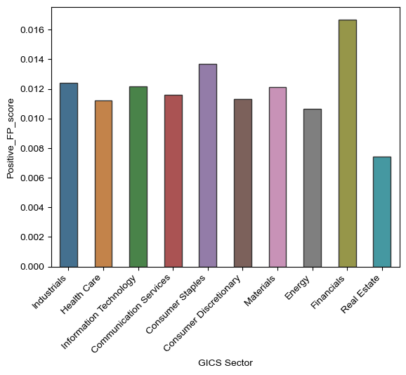
    


The sector with the highest positive R&D scores were the Health Care, IT, Financial, and Real Estate industries, which makes sense especially for the Health Care sector. As they are constantly under pressure to create cures and vaccines especially after the onset of COVID-19, it only makes sense that the health care sector tops the list. Same applies for the IT sector, as technology continues to evolve it would make sense for the R&D sentiment to be positive as they strive towards improving R&D to stay ahead of the curve.


```python
# create the barplot
ax = sns.barplot(data=final_analysis, x="GICS Sector", y="Positive_RD_score", errorbar=None,  saturation=.5, errcolor=".2", edgecolor=".2", width=0.5)

# adjust the x-axis labels
ax.set_xticklabels(ax.get_xticklabels(), rotation=45, ha="right")

# set the figure size
sns.set(rc={'figure.figsize':(12,8)})

```


    
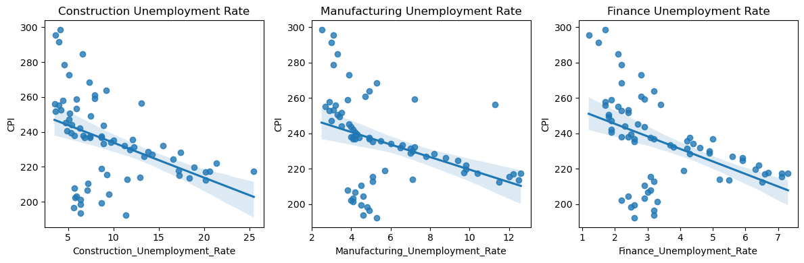
    


# 3. Results:

## Correlation table between the return variable and the 10 sentiment measures:


```python
sentiment_cols = ['LM_pos_score', 'LM_neg_score', 'BHR_pos_score', 'BHR_neg_score','Positive_SC_score', 'Negative_SC_score', 'Positive_RD_score','Negative_RD_score', 'Positive_FP_score', 'Negative_FP_score']

correlations = final_analysis[sentiment_cols + ['ret']].corr()['ret'].to_frame()
correlations.columns = ['correlation with ret']

correlations
```


<div>
<style scoped>
    .dataframe tbody tr th:only-of-type {
        vertical-align: middle;
    }

    .dataframe tbody tr th {
        vertical-align: top;
    }

    .dataframe thead th {
        text-align: right;
    }
</style>
<table border="1" class="dataframe">
  <thead>
    <tr style="text-align: right;">
      <th></th>
      <th>correlation with ret</th>
    </tr>
  </thead>
  <tbody>
    <tr>
      <th>LM_pos_score</th>
      <td>-0.090945</td>
    </tr>
    <tr>
      <th>LM_neg_score</th>
      <td>-0.003743</td>
    </tr>
    <tr>
      <th>BHR_pos_score</th>
      <td>0.059411</td>
    </tr>
    <tr>
      <th>BHR_neg_score</th>
      <td>0.046202</td>
    </tr>
    <tr>
      <th>Positive_SC_score</th>
      <td>-0.023058</td>
    </tr>
    <tr>
      <th>Negative_SC_score</th>
      <td>-0.035132</td>
    </tr>
    <tr>
      <th>Positive_RD_score</th>
      <td>-0.065353</td>
    </tr>
    <tr>
      <th>Negative_RD_score</th>
      <td>0.022159</td>
    </tr>
    <tr>
      <th>Positive_FP_score</th>
      <td>0.084587</td>
    </tr>
    <tr>
      <th>Negative_FP_score</th>
      <td>0.016209</td>
    </tr>
    <tr>
      <th>ret</th>
      <td>1.000000</td>
    </tr>
  </tbody>
</table>
</div>


### Scatter Plot of Each Sentiment Measure Against the Return:


```python
# Select columns of interest
sentiment_cols = ['LM_pos_score', 'LM_neg_score', 'BHR_pos_score', 'BHR_neg_score', 
                  'Positive_SC_score', 'Negative_SC_score', 'Positive_RD_score', 
                  'Negative_RD_score', 'Positive_FP_score', 'Negative_FP_score']
return_col = 'ret'
data = final_analysis[sentiment_cols + [return_col]]

# Create scatterplots
fig, axs = plt.subplots(nrows=5, ncols=2, figsize=(10, 20))
axs = axs.flatten()
for i, col in enumerate(sentiment_cols):
    axs[i].scatter(data[col], data[return_col], alpha=0.5)
    axs[i].set_xlabel(col)
    axs[i].set_ylabel(return_col)
    axs[i].set_title(f'{col} vs {return_col}')

plt.tight_layout()
plt.show()

```


    
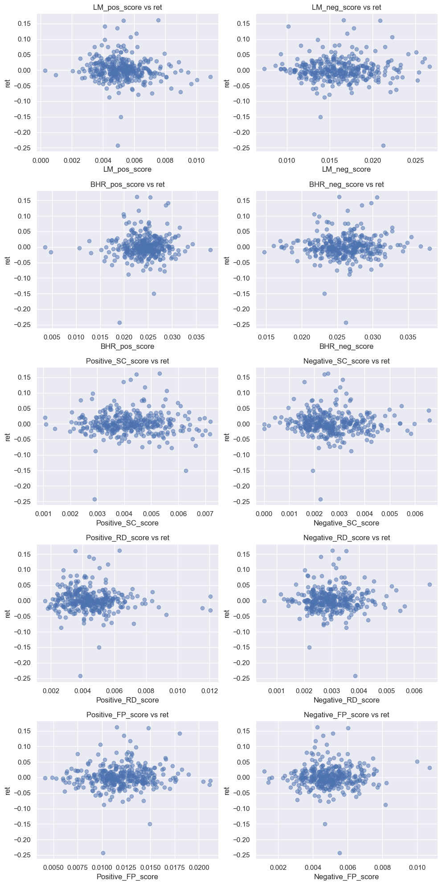
    


### Topic 1:
When looking at the data for the return variable in comparison to the LM sentiment variables, a positive relationship can be seen. Most of the points on the graph are above 0.00 trending towards higher returns as the positive score increase. The same can be seen in greater magnitude within the ML positive sentiment. With a higher density of points falling within the upper right hand region of the graph. 

The opposite is displayed for both the negative ML and LM sentiment. The magnitude of the correlation between returns and these two sentiments is relative to the positive sentiment graphs. These points lie to the left of the graph edging towards negative returns. 

Overall, we can see that there is a consistent pattern in the relationship between the return variable and the four sentiment measures. Positive sentiment measures tended to show a more positive relationship with returns in comparison to the negative sentiments which showed a negative relationship with returns. However, it seems as if the ML(BHR)sentiment measures appear to have a slightly stronger relation with the return variable.

### Topic 2:

I found that my data was in agreement with the Garcia, Hu, and Rohrer paper. One reason they may have included such a vast amount of data is because a relatively small sample size like mine could have led to extremities that could heavily skew the data, causing bias results. Their data encompassed many more firms, years, and additional controls which would help to decrease the amount of outliers within the data. The amount of additional firms, years, and controls could have also helped to strengthen the validity of the study. When conducting a study, such as this cross sectional event study between sentiments and stock returns, it is important to collect conclusive data that either proves or debunks your hypothesis.

### Topic 3:
Unfortunately my contextual sentiments don't look different enough in relations with my return variable. There's no real need for further investigation as a regression line shows no trends between the contextual sentiment variables and the return variable.


### 1. Negative RD Sentiment:


```python
sns.regplot(data=final_analysis, x='Negative_RD_score', y='ret')
plt.show()

```


    
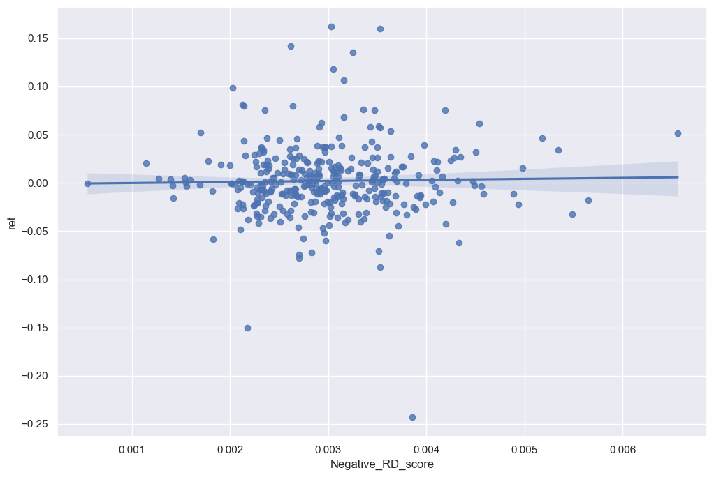
    


### 2. Positive RD Sentiment:


```python
sns.regplot(data=final_analysis, x='Positive_RD_score', y='ret')
plt.show()
```


    
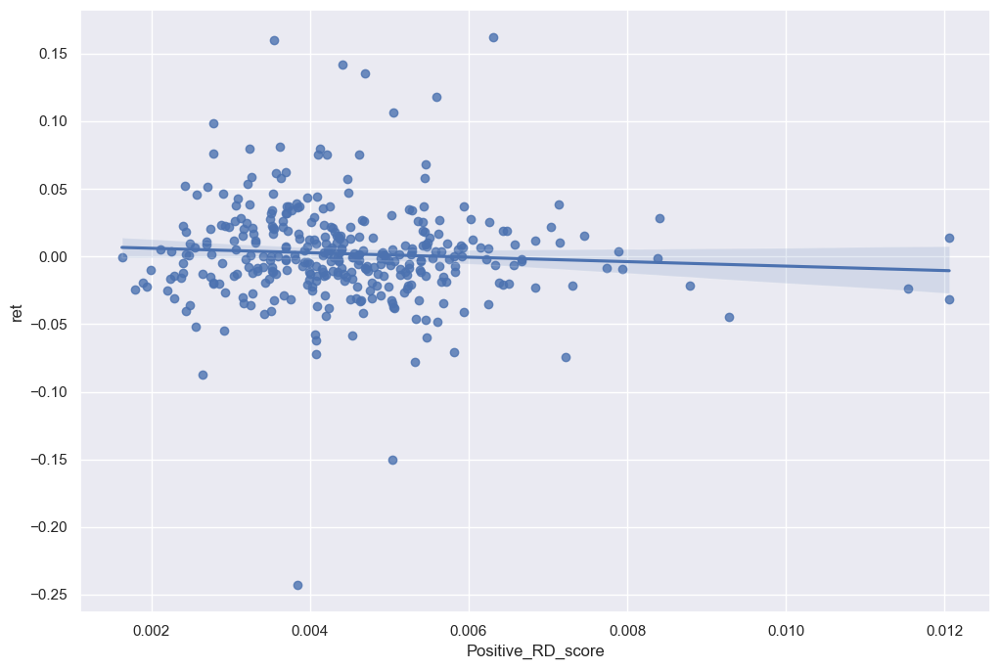
    


### 3. Negative Supply Chain Sentiment:


```python
sns.regplot(data=final_analysis, x='Negative_SC_score', y='ret')
plt.show()
```


    
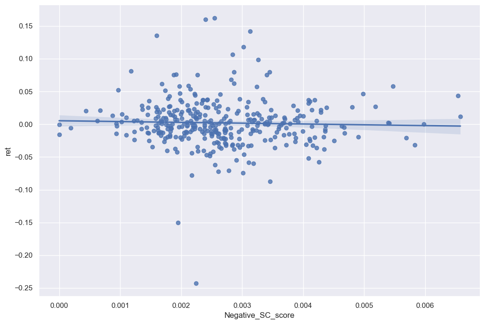
    


### 4. Positive Supply Chain Sentiment:


```python
sns.regplot(data=final_analysis, x='Positive_SC_score', y='ret')
plt.show()
```


    
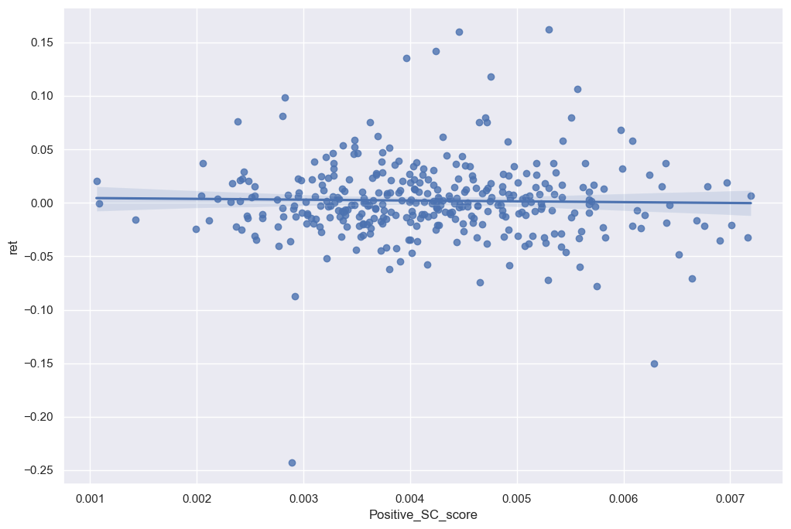
    


### 5. Negative Financial Performance Sentiment:


```python
sns.regplot(data=final_analysis, x='Negative_FP_score', y='ret')
plt.show()
```


    
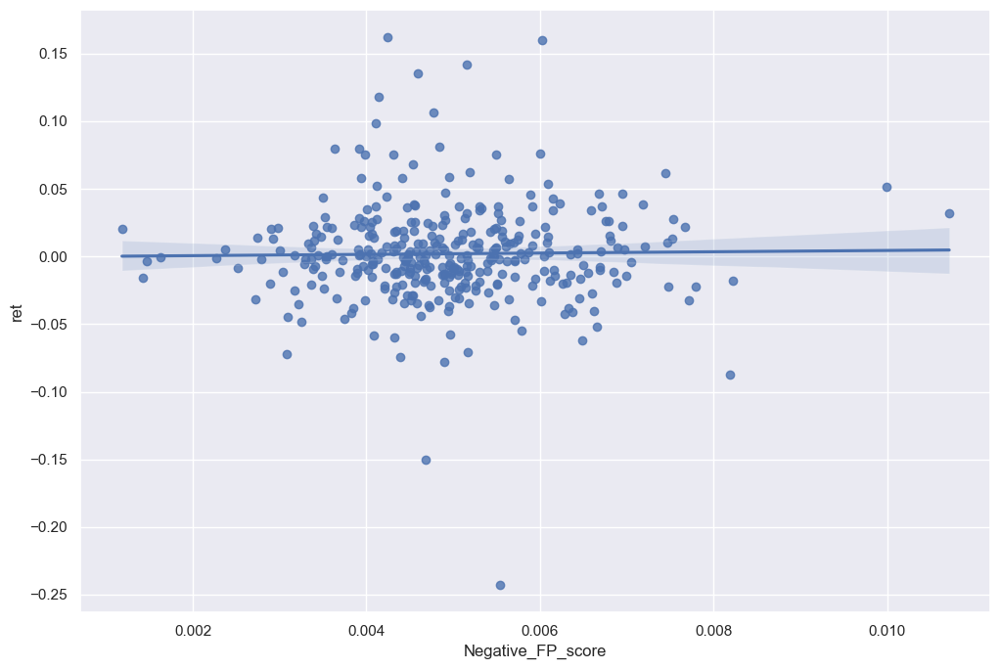
    


### 6. Positive Financial Performance Sentiment:


```python
sns.regplot(data=final_analysis, x='Positive_FP_score', y='ret')
plt.show()
```


    
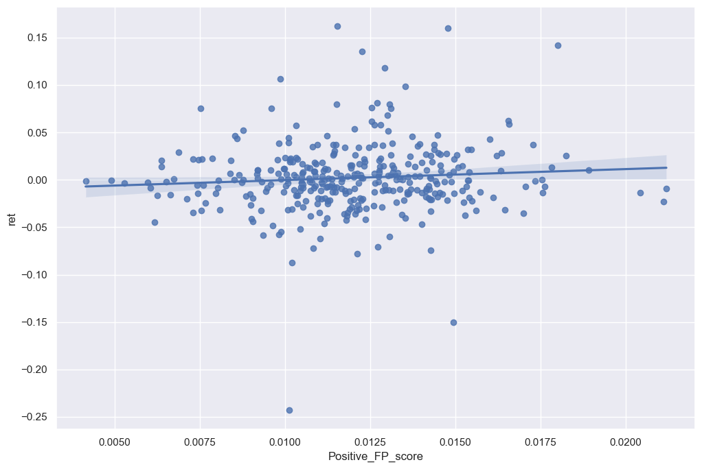
    


As better displayed in the graphs above, there's a slight positive trend within the data frames but the correlation isn't high enough to require further investigation within the topics. However when looking at the sentiment scores in comparison to financial ratios there are some noticeable trends. 


```python
sns.regplot(data=final_analysis, x='Positive_RD_score', y='cash_a')
plt.show()
```


    
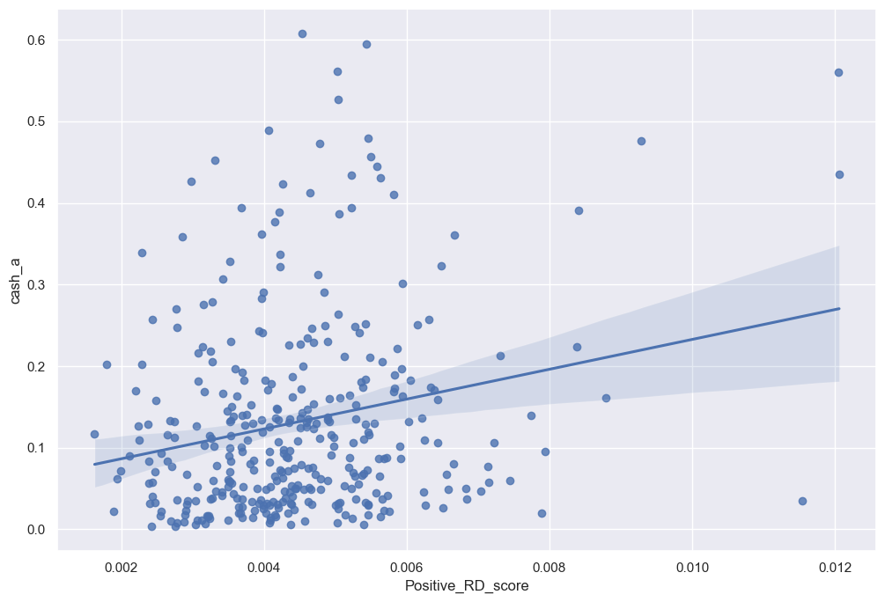
    


A great example would be in the above graph. A 10-K ridden with positive R&D sentiments tended to have a higher cash per asset ratio. With a noticeably positive regression line, it's hard not to notice the importance of good quality R&D to a companies assets.


```python
sns.regplot(data=final_analysis, x='Positive_SC_score', y='prof_a')
plt.show()
```


    
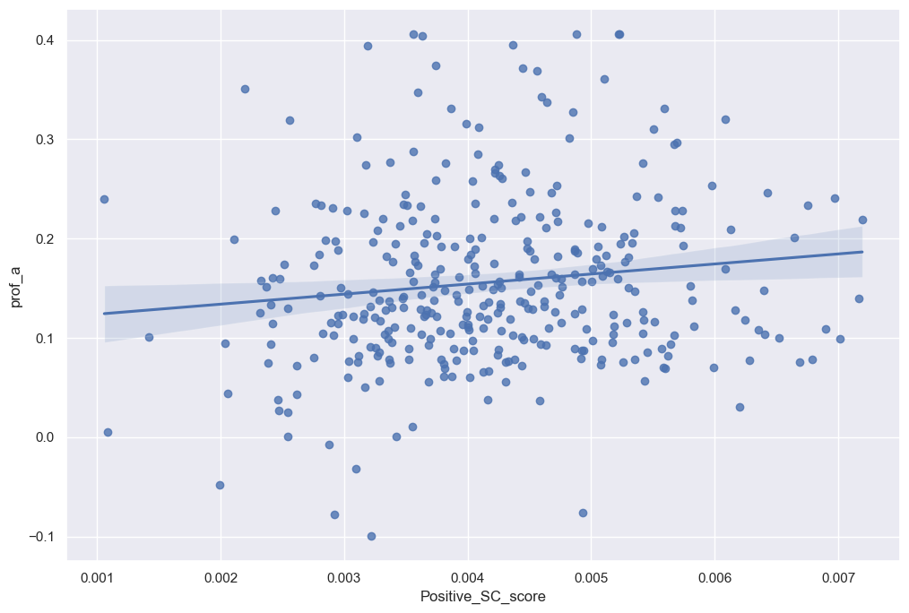
    


One last great example I found for this topic is in the above graph. Whereas there was no correlation between returns and a positive supply chain sentiment. I noticed there was a positive trend between profit per asset and 10-K's that displayed a positive sentiment towards their supply chain. As supply chain costs and obstacles decrease and the business continues to thrive within its supply chain function, it makes sense that profitability would have a moderately positive correlation with firms that have  positive sentiment towards supply chain displayed in their 10-K. 
 

### Topic 4:

However when looking at the 3 contextual sentiment measures in comparison with the return variable, there isn't a real difference in the sign and magnitude. I believe I made a comprehensive list to detect the contextual sentiment of the 10-K. However looking at the graphs in regards to the return, I can tell that companies try to disguise the sentiment of their 10-K if it evokes a negative sentiment. That's why hardly any of my negative contextual sentiments have a regression higher than 0. Whereas, the positive contextual sentiment variables seem to have a slight positive correlation in regards to the return variable.


```python

```
